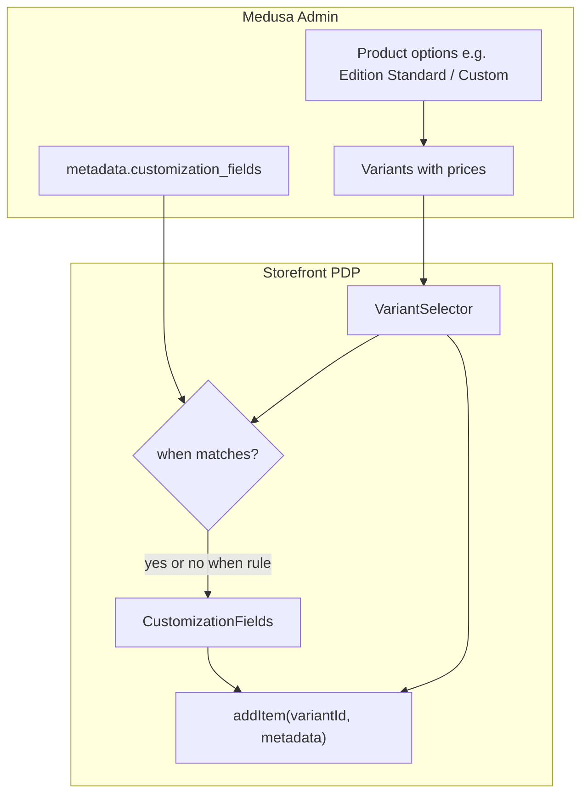

# Product customization

Per-product engraving text, dropdowns, and logo presets/uploads on the product detail page (PDP). Shoppers configure on the PDP; values are stored on Medusa **line item metadata** and shown read-only in cart, checkout, and orders.

**Pricing** for customized products uses normal Medusa **variant prices** (not metadata surcharges). Optional `when` rules tie the customization UI to a specific option value (e.g. `Edition: Custom`).

## How it works



| Concern | Mechanism |
|---------|-----------|
| Price | Selected variant `calculated_price` → cart `variant_id` |
| Show fields | `when` + `isCustomizationEnabled()` or always if no `when` |
| Persist choices | Line item `metadata.customizations` |

---

## Setup paths

Choose one path per product.

### Path A — Always show customization (single price tier)

Use when every variant (or the only variant) supports customization at the same price.

1. **Medusa Admin** → Product → **Metadata** → key `customization_fields`.
2. Value: JSON **array** of fields (or minified string).

```json
[
  {
    "id": "engraving_text",
    "type": "text",
    "label": "Name / Text to Engrave",
    "helper": "This text will be 3D printed on your product",
    "max_length": 12,
    "required": false
  },
  {
    "id": "logo",
    "type": "logo",
    "label": "Logo",
    "required": false,
    "allow_upload": true,
    "accept": ["image/png", "image/svg+xml", "image/jpeg"],
    "max_size_mb": 2,
    "options": [
      { "value": "none", "label": "No Logo" },
      { "value": "batman", "label": "Batman", "image_url": "https://your-cdn.com/batman.png" }
    ]
  }
]
```

3. Save and reload the PDP.

### Path B — Variant-priced customization (Standard vs Custom)

Use when **Custom** variants cost more and customization inputs should appear only for Custom.

#### Step 1: Product options and variants (Medusa Admin)

1. **Options** — e.g. `Edition` with values `Standard` and `Custom` (plus `Color` etc. if needed).
2. **Variants** — generate the matrix; set **higher prices** on all `Custom` combinations.
3. Note the exact option **title** and value strings as shown in Admin (used in `when`).

Example matrix:

| Edition | Color | Price (INR) | Customization UI |
|---------|-------|-------------|------------------|
| Standard | Teal | 449 | Hidden |
| Custom | Teal | 549 | Shown |

#### Step 2: Metadata

Key: `customization_fields`. Value: JSON **object** with `when` + `fields` (string in Admin is OK):

```json
{
  "when": { "option": "Edition", "value": "Custom" },
  "fields": [
    {
      "id": "engraving_text",
      "type": "text",
      "label": "Name / Text to Engrave",
      "helper": "This text will be 3D printed on your product",
      "max_length": 12,
      "required": true
    },
    {
      "id": "logo",
      "type": "logo",
      "label": "Logo",
      "allow_upload": true,
      "options": [{ "value": "none", "label": "No Logo" }]
    }
  ]
}
```

**Shorthand for `when`:** `"when": "Edition:Custom"` (first `:` separates option title from value).

#### Step 3: Verify storefront

- PDP price updates when switching Standard ↔ Custom.
- Customization fields appear only on **Custom**.
- Hint when gated off: *Select Custom to add personalization.*
- Cart line uses the Custom `variant_id` and shows engraving in metadata.

---

## Metadata reference

### Key

| Metadata key | Required | Description |
|--------------|----------|-------------|
| `customization_fields` | Yes (for multi-field) | Array, object, or JSON string — see shapes below |

### Shapes for `customization_fields`

| Shape | Example | `when` | Use case |
|-------|---------|--------|----------|
| Array | `[{ "id": "engraving_text", ... }]` | None — always show | Path A |
| Object | `{ "when": {...}, "fields": [...] }` | Optional gate | Path B |
| String | Minified JSON of either shape | Parsed after `JSON.parse` | Typical Admin entry |

Invalid JSON, empty `fields`, or invalid field entries → no customization UI.

### `when` gate (Path B)

| Property | Description |
|----------|-------------|
| `option` | Medusa product option **title** (PDP label), e.g. `Edition` |
| `value` | Option value on the variant, e.g. `Custom` |

Matching is **case-insensitive** for both `option` title and `value`.

| Form | Example |
|------|---------|
| Object | `{ "option": "Edition", "value": "Custom" }` |
| Shorthand string | `"Edition:Custom"` |

If `when` is omitted (array-only metadata), customization is always visible when fields exist.

### Field schema

| Property | Applies to | Description |
|----------|------------|-------------|
| `id` | all | Stable key; form state + line item `field_id` |
| `type` | all | `"text"` \| `"select"` \| `"logo"` |
| `label` | all | PDP, cart, orders |
| `helper` | all | Optional hint |
| `required` | all | If `true`, required before add-to-cart (only when fields visible) |
| `max_length` | text | Default `12` |
| `placeholder` | text | Input placeholder |
| `options` | select, logo | `{ value, label, image_url? }[]` |
| `allow_upload` | logo | Default `true` |
| `accept` | logo | MIME types; default PNG, SVG, JPEG |
| `max_size_mb` | logo | Default `2` |

**Parsing rules**

- `select` without `options` → field dropped.
- `logo` needs preset `options` and/or `allow_upload: true`.

### Legacy single-text metadata

Without `customization_fields`, these keys enable one text field (`id`: `engraving_text`):

| Key | Example |
|-----|---------|
| `customization` | `true` |
| `max_chars` | `12` |
| `customization_label` | `"Name"` |
| `customization_helper` | `"..."` |
| `customization_required` | `true` |

No `when` support in legacy mode.

---

## Storefront behavior

| Area | Behavior |
|------|----------|
| PDP | Fields when `when` matches or no `when`; validate on add-to-cart; price from selected variant |
| Variant change | Leaving gated option clears customization form and errors |
| Cart / slide-over | Read-only `CustomizationDisplay` |
| Checkout / orders | Read-only from line item metadata |

**Logo upload:** `POST {MEDUSA_BACKEND}/store/customization/upload` — see `lib/customization/uploadLogo.ts`. Backend must return `{ files: [{ url, filename?, id? }] }`.

---

## Line item metadata

Written by `buildLineItemMetadata()` on add-to-cart (only for **visible** fields):

```json
{
  "customizations": [
    {
      "field_id": "engraving_text",
      "type": "text",
      "label": "Name / Text to Engrave",
      "value": "ALEX",
      "display": "ALEX"
    },
    {
      "field_id": "logo",
      "type": "logo",
      "label": "Logo",
      "source": "preset",
      "value": "batman",
      "display": "Batman",
      "image_url": "https://your-cdn.com/batman.png"
    }
  ],
  "customization": "ALEX"
}
```

| Key | Purpose |
|-----|---------|
| `customizations` | Canonical array for display |
| `customization` | Legacy single string when `engraving_text` is set |

Uploaded logos: `source: "upload"`, `value` / `image_url` = file URL, `filename` for display.

---

## Medusa API requirements

### Product retrieve must include metadata

[`lib/data/products.ts`](../lib/data/products.ts) — `getProductById`:

```ts
fields: "...,*variants,...,+metadata"
```

Without `+metadata`, `product.metadata` is `null` and no fields render.

```bash
curl -s "http://localhost:9000/store/products/<PRODUCT_ID>?fields=+metadata" \
  -H "x-publishable-api-key: $NEXT_PUBLIC_MEDUSA_PUBLISHABLE_KEY" \
  | jq '.product.metadata.customization_fields'
```

### Region for variant prices

Pass `region_id` on product retrieve (already done in `getProductById`) so `variants[].calculated_price` is populated.

---

## Developer reference

### Public API (`@/lib/customization`)

| Export | Role |
|--------|------|
| `parseProductCustomizationConfig(metadata)` | `{ fields, when? }` |
| `parseProductCustomizationFields(metadata)` | `fields` only (backward compatible) |
| `hasCustomizationFields(metadata)` | Whether product defines any fields |
| `isCustomizationEnabled(when, selectedOptions)` | Gate UI by variant selection |
| `validateCustomizationValues(fields, values)` | PDP validation |
| `buildLineItemMetadata(fields, values)` | Cart line item metadata |
| `parseLineItemCustomizations(metadata)` | Cart/order display |
| `uploadCustomizationLogo(file)` | Logo upload |

`selectedOptions` is keyed by **option title** (same as `VariantSelector`), e.g. `{ Edition: "Custom", Color: "Teal" }`.

### Code map

| Path | Role |
|------|------|
| `lib/customization/types.ts` | `CustomizationWhen`, field types, line item types |
| `lib/customization/parseProductFields.ts` | Metadata → config |
| `lib/customization/isCustomizationEnabled.ts` | Variant gate |
| `lib/customization/validate.ts` | PDP validation |
| `lib/customization/buildMetadata.ts` | Form → line item metadata |
| `lib/customization/parseLineItem.ts` | Line item → display |
| `lib/customization/uploadLogo.ts` | Logo upload |
| `components/product/ProductPageClient.tsx` | PDP wiring |
| `components/product/CustomizationFields.tsx` | PDP form |
| `components/product/CustomizationDisplay.tsx` | Read-only summary |
| `lib/customization/customization.test.ts` | Unit tests |

### Local mocks

[`mocks/products.json`](../mocks/products.json) — sample array-shaped `customization_fields` for offline UI.

### Common metadata mistakes

**Wrong** — config wrapped in an array, and `fields` is a single object:

```json
[{"when":{"option":"Variant","value":"Custom"},"fields":{"id":"engraving_text","type":"text","label":"Name"}}]
```

**Correct** — bare object, `fields` is an **array**:

```json
{"when":{"option":"Variant","value":"Custom"},"fields":[{"id":"engraving_text","type":"text","label":"Name","max_length":7,"required":false}]}
```

The parser tolerates the mistaken array wrapper and a single field object, but the correct shape is recommended for new products.

---

## Troubleshooting

| Symptom | Likely cause | Fix |
|---------|--------------|-----|
| No customization UI | Metadata not in API response | Add `+metadata` to `getProductById` fields |
| No customization UI | Invalid / empty JSON | Validate `customization_fields` in Admin |
| No customization UI | Wrong JSON shape | See **Common metadata mistakes** below |
| Fields never appear (Path B) | `when.option` mismatch | Match Medusa option **title** exactly (case-insensitive) |
| Fields never appear (Path B) | `when.value` mismatch | Match variant option value (e.g. `Custom` not `customized`) |
| Price does not change | Missing region / variant price | Set prices on Custom variants; check `region_id` on retrieve |
| Customization on Standard order | Shopper added before switch | Form clears on variant change; metadata only sent for visible fields |
| Logo upload fails | Backend route missing | Implement `POST /store/customization/upload` |

---

## Tests

```bash
npx vitest run lib/customization/customization.test.ts
```

Covers: array and object metadata, `when` shorthand, JSON string from Admin, `isCustomizationEnabled`, line item round-trip, legacy `customization` string.

---

## What we do not support (yet)

- Per-field `when` (different fields per option value) — use one shared `when` at product level.
- Metadata-based price deltas — use variant prices instead.
- Server-side enforcement that customization metadata requires a Custom variant — would need a Medusa workflow/plugin.
